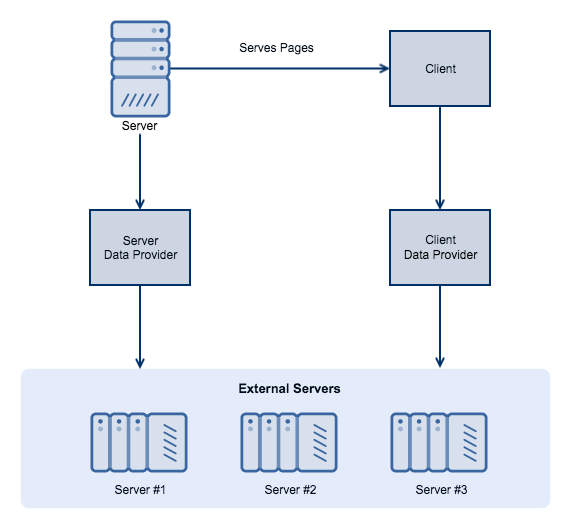

# Data Provider

### Introduction

The Data Provider component is a Site Base library that is based on the [Fetch API](https://developer.mozilla.org/en-US/docs/Web/API/Fetch_API)interface. It provides a set of functions which fetch data from multiple sources. It works both on server-side and client-side \(browser based\) applications, bringing data from sources such as [Squiz Matrix](https://conf.willhillatlas.com/display/INFO/CMS+Squiz+Matrix). Data transactions between the browser and the network is transmitted as JavaScript content.The data can be gathered by any library that makes a request and may include metrics. It can also be used to fetch customer-related data, which will be displayed in the browser.

### APIs {#DataProvider-APIs}

The public APIs available to developers using Site Base are:

| `init()` | An initialisation function that allows you to configure multiple providers and data sources. |
| --- | --- | --- |
| `dataProvider()` | The main data fetching function, which is used to specify the URL to which data requests will be made. Collects logging and metrics metadata. |
| `getEndpoint()` | A function that creates the target URL, using provider information. It is based on two arguments supplied by the requesting library. |

### Functionality

The component's fetching functions include retrieval of the following data:

* **Customer balances, payments and rewards**. Datadisplayed on the website
* **Web footer links, including payment methods and regulatory information**. These links contain all the information used to build a Footer. The links may vary between sites, for different domains.
* **Promotional codes**. Displayed data that changes often.
* **User links**. User-specific links that the user will see if they are logged in to the site. They are not product-specific.
* **Product navigation**. 
* **Translation**. All data that requires translation. Displayed anywhere, such as the Header or Footer.

### See also {#DataProvider-Seealso}

* [Squiz Matrix guide](https://conf.willhillatlas.com/display/INFO/CMS+Squiz+Matrix)
* [Example of a data provider call](https://git.nonprod.williamhill.plc/wh-site-base/demo-app/blob/057e66a5df97db1b4b03ec1185fca85cb933b4c8/src/main/utils/data-provider.js#L64)
* [Fetch API](https://developer.mozilla.org/en-US/docs/Web/API/Fetch_API)
* [https://git.nonprod.williamhill.plc/wh-site-base/data-provider/blob/master/README.md](https://git.nonprod.williamhill.plc/wh-site-base/data-provider/blob/master/README.md)
* [https://git.nonprod.williamhill.plc/wh-site-base/squiz-data-provider/blob/master/README.md](https://git.nonprod.williamhill.plc/wh-site-base/squiz-data-provider/blob/master/README.md)

